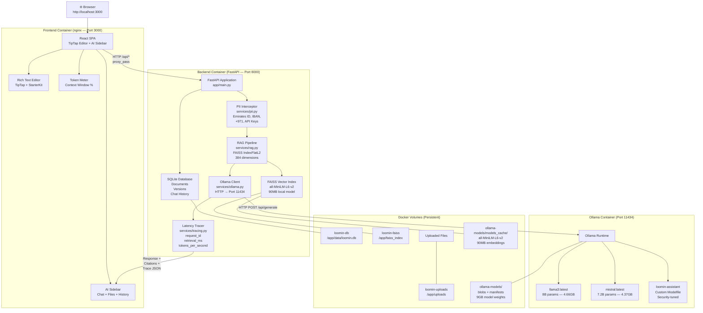
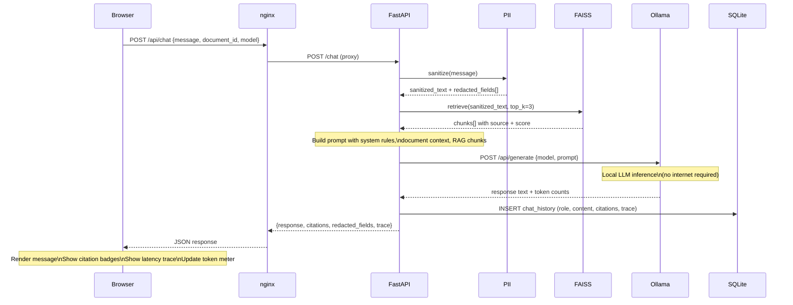
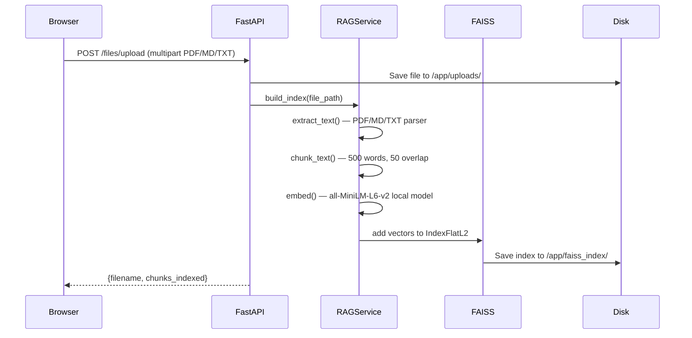
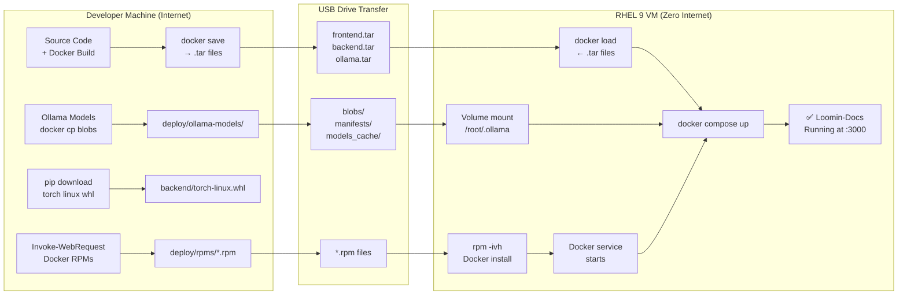
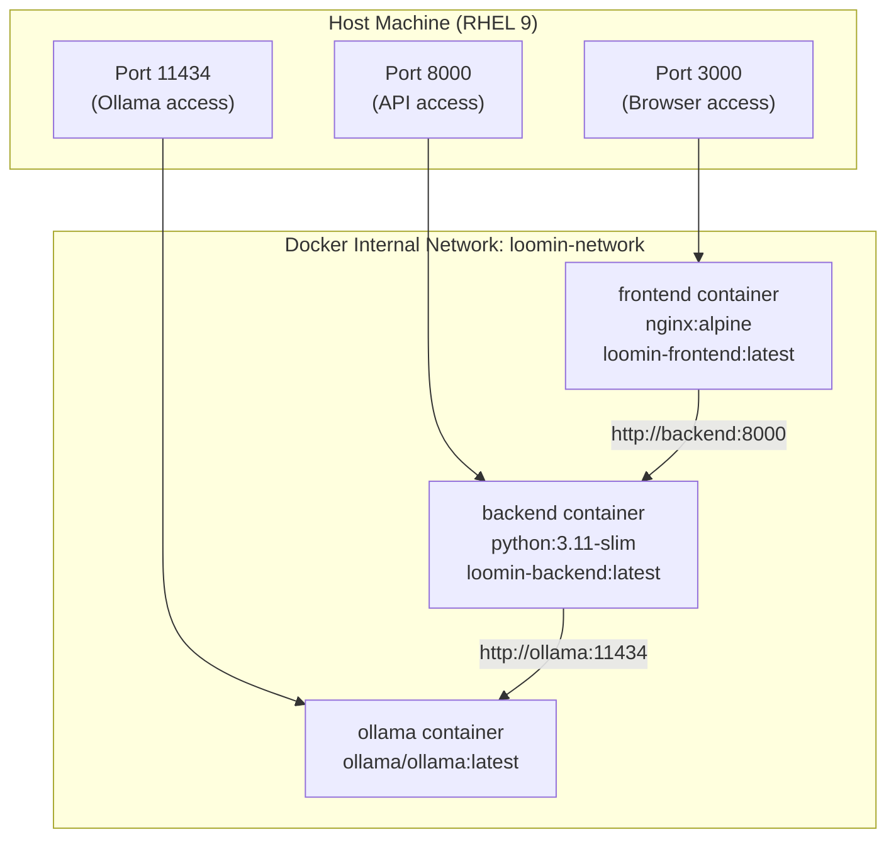
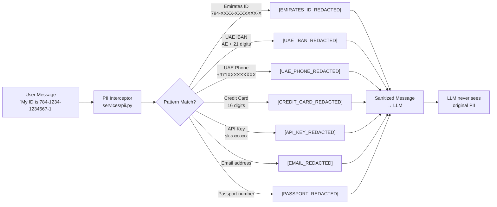

# Loomin-Docs — Architecture

## System Architecture Diagram

---

## Request Flow — POST /chat

---

## File Upload & RAG Indexing Flow

---

## Air-Gap Deployment Flow

---

## Container Network Architecture

---

## PII Interception — UAE Patterns

