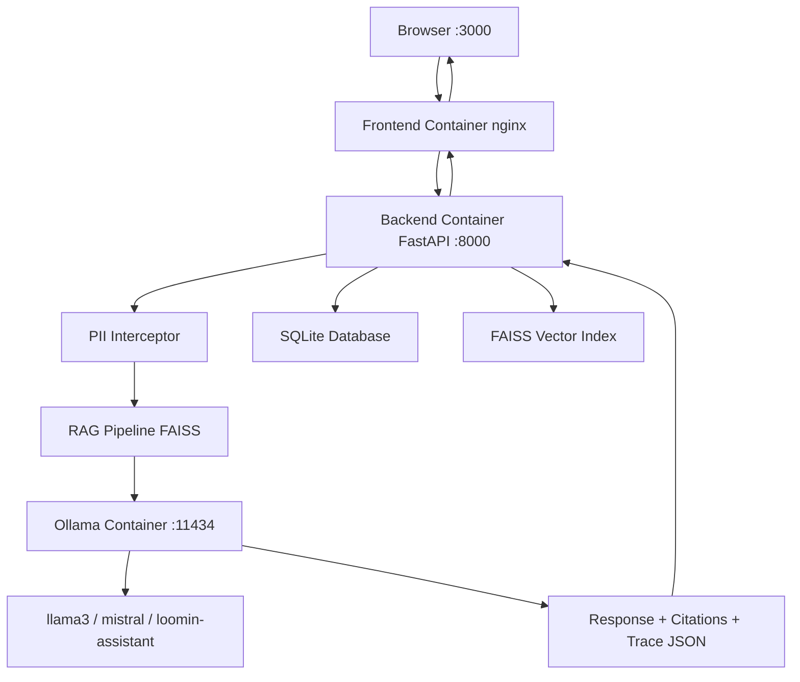

# Loomin-Docs 🔵
### AI-Powered Collaborative Document Editor — Air-Gapped Enterprise Deployment

> Built for CyberCore Technology Assessment | Abu Dhabi, UAE
> Designed for zero-network, air-gapped RHEL 9 enterprise environments

---

## 📋 Table of Contents

1. [Project Overview](#project-overview)
2. [Architecture](#architecture)
3. [Features](#features)
4. [Tech Stack & Decisions](#tech-stack--decisions)
5. [Project Structure](#project-structure)
6. [Local Development Setup](#local-development-setup)
7. [Air-Gap Deployment on RHEL 9](#air-gap-deployment-on-rhel-9)
8. [API Reference](#api-reference)
9. [RAG Verification Test](#rag-verification-test)
10. [Known Challenges & Solutions](#known-challenges--solutions)
11. [Troubleshooting](#troubleshooting)

---

## Project Overview

Loomin-Docs is a fully self-contained, air-gapped AI document editor built for enterprise
environments where data sovereignty is non-negotiable. Organizations like UAE government
agencies, sovereign wealth funds, ADNOC, and financial institutions under CBUAE regulations
cannot send confidential documents to external cloud AI services.

Loomin-Docs solves this by running everything — the editor, the AI inference engine, the
vector database, and all model weights — on a single server with zero internet dependency
after initial setup.

**The evaluator receives a USB drive. They run one script. The entire system starts.**

---

## Architecture

```
┌─────────────────────────────────────────────────────────────────┐
│                        BROWSER (Port 3000)                      │
│                     React + TipTap Editor                       │
│              AI Sidebar │ Files Tab │ Token Meter               │
└──────────────────────────┬──────────────────────────────────────┘
                           │ HTTP
┌──────────────────────────▼──────────────────────────────────────┐
│                   FRONTEND CONTAINER (nginx)                    │
│                        Port 3000                                │
│              Serves React SPA + Proxies /api → Backend          │
└──────────────────────────┬──────────────────────────────────────┘
                           │ HTTP /api/*
┌──────────────────────────▼──────────────────────────────────────┐
│                   BACKEND CONTAINER (FastAPI)                   │
│                        Port 8000                                │
│                                                                 │
│  ┌─────────────┐  ┌──────────────┐  ┌───────────────────────┐  │
│  │ PII         │  │ RAG Pipeline │  │ Latency Tracer        │  │
│  │ Interceptor │→ │ FAISS +      │→ │ request_id            │  │
│  │ UAE patterns│  │ MiniLM-L6-v2 │  │ retrieval_ms          │  │
│  └─────────────┘  └──────┬───────┘  │ tokens_per_second     │  │
│                          │          └───────────────────────┘  │
│  ┌─────────────┐  ┌──────▼───────┐                             │
│  │ SQLite DB   │  │ Ollama Client│                             │
│  │ Documents   │  │ llama3       │                             │
│  │ Versions    │  │ mistral      │                             │
│  │ Chat History│  │ loomin-asst  │                             │
│  └─────────────┘  └──────┬───────┘                             │
└──────────────────────────┼──────────────────────────────────────┘
                           │ HTTP :11434
┌──────────────────────────▼──────────────────────────────────────┐
│                   OLLAMA CONTAINER (Port 11434)                 │
│              Local LLM Inference — No Internet Required         │
│         Models: llama3:latest │ mistral:latest │ loomin-asst   │
│         Model weights volume-mounted from deploy/ollama-models/ │
└─────────────────────────────────────────────────────────────────┘
```

### Mermaid Diagram



---

## Features

### Frontend (React + TypeScript)
- **Rich Text Editor** — TipTap with full Markdown support, headings, bold, italic, lists, code blocks
- **AI Sidebar** — Persistent chat interface with three tabs: Chat, Files, History
- **Contextual Editing** — Select text → click Summarize / Improve / Rephrase → AI updates document in place
- **Model Selector** — Toggle between llama3, mistral, and loomin-assistant via dropdown
- **Files Tab** — Drag and drop PDF, MD, TXT, DOCX files for RAG indexing
- **Token Meter** — Real-time progress bar showing % of model context window used
- **Version History** — Every document save creates a snapshot; click to restore any version
- **PII Shield** — Visual indicator showing when sensitive data was intercepted and masked
- **Citation Badges** — Clickable chips showing which file and chunk each AI answer came from
- **Latency Trace** — Every AI response shows retrieval time and tokens per second

### Backend (Python + FastAPI)
- **FAISS Vector Search** — Local embedding with all-MiniLM-L6-v2 (384 dimensions)
- **RAG Pipeline** — Retrieves top 3 relevant chunks, grounds every response with citations
- **SQLite Persistence** — Documents, version snapshots, and chat history all persisted locally
- **PII Interceptor** — Masks Emirates ID, UAE IBAN, +971 phone numbers, API keys, credit cards
- **Latency Tracing** — Every /chat response includes request_id, retrieval_ms, tokens_per_second
- **Health Check** — /health endpoint reports status of all 4 subsystems
- **Soft Delete** — Documents are never permanently deleted, always recoverable

### Security & Observability
- Zero external API calls — all inference is local
- PII never reaches the LLM — intercepted and masked before prompt construction
- Every AI response is traceable via request_id
- Modelfile enforces strict enterprise behavior: cite sources, never fabricate, refuse off-topic

---

## Tech Stack & Decisions

| Component | Choice | Why |
|-----------|--------|-----|
| Editor | TipTap | Programmatic content control — can replace selected text via API. Quill cannot do this cleanly |
| Vector DB | FAISS | Pure Python library, no server process, zero config, air-gap friendly. ChromaDB requires a server |
| Database | SQLite | File-based, zero config, perfect for single-node air-gap. PostgreSQL needs a separate container |
| Embeddings | all-MiniLM-L6-v2 | Fast, accurate, only 90MB. Larger models add no meaningful accuracy for document retrieval |
| LLM Runtime | Ollama | Only tool that runs open-source LLMs locally with zero API key and zero internet after setup |
| Default Model | llama3 | Better instruction following than mistral for enterprise document tasks |
| Frontend Build | Vite + React | Fast HMR in development, clean production build for nginx serving |
| Styling | Tailwind CSS v4 | Utility-first, no runtime overhead, works perfectly with Vite |

---

## Project Structure

```
loomin-docs/
├── frontend/
│   ├── src/
│   │   ├── api/
│   │   │   └── client.ts           ← Axios instance + all API functions
│   │   ├── components/
│   │   │   ├── Editor.tsx          ← TipTap rich text editor + floating toolbar
│   │   │   ├── AISidebar.tsx       ← Chat + Files + History tabs + citations
│   │   │   ├── FilesTab.tsx        ← Drag-and-drop file upload + FAISS indexing
│   │   │   └── TokenMeter.tsx      ← Context window % progress bar
│   │   ├── App.tsx                 ← Layout + shared state management
│   │   ├── App.css                 ← Cyber dark theme styles
│   │   ├── index.css               ← Tailwind import
│   │   └── main.tsx
│   ├── index.html
│   ├── nginx.conf                  ← nginx config: serve React + proxy /api to backend
│   ├── Dockerfile                  ← Multi-stage: node build + nginx serve
│   ├── package.json
│   ├── tailwind.config.js
│   ├── postcss.config.js
│   └── vite.config.ts
│
├── backend/
│   ├── app/
│   │   ├── __init__.py
│   │   ├── main.py                 ← FastAPI app with lifespan + CORS + routers
│   │   ├── core/
│   │   │   └── config.py           ← Pydantic Settings reading from .env
│   │   ├── models/
│   │   │   └── database.py         ← SQLAlchemy async: documents, versions, chat_history
│   │   ├── routes/
│   │   │   ├── chat.py             ← POST /chat — full RAG + PII + trace pipeline
│   │   │   ├── documents.py        ← CRUD + auto version snapshots
│   │   │   ├── files.py            ← Upload + FAISS indexing + content extraction
│   │   │   ├── health.py           ← GET /health — all 4 subsystem checks
│   │   │   └── tokens.py           ← POST /token-count — tiktoken counting
│   │   └── services/
│   │       ├── rag.py              ← FAISS IndexFlatL2 + chunk + embed + retrieve
│   │       ├── ollama.py           ← OllamaClient: generate, list_models, ping
│   │       ├── pii.py              ← UAE PII patterns: sanitize() function
│   │       └── tracing.py          ← TraceContext + compute_trace()
│   ├── download_models.py          ← Pre-downloads all-MiniLM-L6-v2 for air-gap
│   ├── requirements.txt
│   ├── Dockerfile                  ← python:3.11-slim + libgomp1 + uvicorn
│   ├── .env
│   └── .env.example
│
├── deploy/
│   ├── docker-compose.yml          ← Production: frontend + backend + ollama
│   ├── setup.sh                    ← RHEL 9 bootstrap: install Docker + load images + start
│   ├── Modelfile                   ← Ollama custom model: security-tuned system prompt
│   ├── rpms/                       ← Offline Docker RPM packages for RHEL 9
│   │   ├── containerd.io-1.6.31-3.1.el9.x86_64.rpm
│   │   ├── docker-ce-26.1.4-1.el9.x86_64.rpm
│   │   ├── docker-ce-cli-26.1.4-1.el9.x86_64.rpm
│   │   ├── docker-buildx-plugin-0.14.1-1.el9.x86_64.rpm
│   │   ├── docker-compose-plugin-2.27.1-1.el9.x86_64.rpm
│   │   └── README.md
│   ├── images/                     ← Docker image .tar exports (generated by prepare script)
│   │   ├── frontend.tar            ← loomin-frontend:latest
│   │   ├── backend.tar             ← loomin-backend:latest
│   │   └── ollama.tar              ← ollama/ollama:latest
│   ├── ollama-models/              ← Ollama model blobs + embedding model cache
│   │   ├── blobs/                  ← llama3 + mistral model weights (9GB+)
│   │   ├── manifests/              ← Model metadata
│   │   ├── models_cache/           ← all-MiniLM-L6-v2 sentence-transformers cache
│   │   └── README.md
│   └── scripts/
│       └── prepare_offline_package.sh  ← Run on dev machine to export all .tar files
│
├── verify_rag.py                   ← RAGAS faithfulness test (Ollama as local judge)
├── docker-compose.dev.yml          ← Local dev: Ollama only
├── README.md                       ← This file
├── ARCHITECTURE.md                 ← Mermaid system diagram
├── DECISIONS.md                    ← Tool selection rationale
└── .gitignore
```

---

## Local Development Setup

### Prerequisites
- Windows 11 with WSL2 enabled
- Docker Desktop installed and running
- Python 3.11 installed
- Node.js 20+ installed
- Git installed

### Step 1 — Clone the repository

```bash
git clone https://github.com/YOUR_USERNAME/loomin-docs.git
cd loomin-docs
```

### Step 2 — Start Ollama (local dev)

```powershell
docker compose -f docker-compose.dev.yml up -d
```

Wait 30 seconds for Ollama to start, then pull models:

```powershell
docker exec loomin-ollama-dev ollama pull llama3
docker exec loomin-ollama-dev ollama pull mistral
```

Verify Ollama is running:

```powershell
curl.exe http://localhost:11434/api/tags
```

### Step 3 — Setup Backend

```powershell
cd backend
py -3.11 -m venv venv
venv\Scripts\activate
pip install torch --index-url https://download.pytorch.org/whl/cpu
pip install -r requirements.txt
```

Copy `.env.example` to `.env`:

```powershell
copy .env.example .env
```

Download the embedding model for offline use:

```powershell
python download_models.py
```

Start the backend:

```powershell
uvicorn app.main:app --reload --port 8000
```

Verify at: http://localhost:8000/docs

### Step 4 — Setup Frontend

Open a new terminal:

```powershell
cd frontend
npm install
npm run dev
```

Open browser at: http://localhost:5173

### Step 5 — Verify Everything Works

1. Open http://localhost:5173
2. Type something in the editor
3. Upload a PDF or TXT file in the Files tab
4. Ask a question in the AI chat sidebar
5. Verify citations appear below the AI response
6. Check the token meter updates

---

## Air-Gap Deployment on RHEL 9

> This section is for the evaluation VM — a clean RHEL 9 machine with zero internet access.

### What You Need on the USB Drive

```
loomin-docs/
├── deploy/
│   ├── setup.sh                ← The only script you need to run
│   ├── docker-compose.yml
│   ├── Modelfile
│   ├── rpms/                   ← 5 Docker RPM files
│   ├── images/
│   │   ├── frontend.tar        ← React app image
│   │   ├── backend.tar         ← FastAPI app image
│   │   └── ollama.tar          ← Ollama inference engine image
│   └── ollama-models/
│       ├── blobs/              ← llama3 + mistral model weights
│       ├── manifests/          ← Model metadata
│       └── models_cache/       ← Embedding model (all-MiniLM-L6-v2)
```

### Step-by-Step RHEL 9 Setup

**Step 1 — Copy files from USB to the VM**

```bash
cp -r /media/usb/loomin-docs /opt/loomin-docs
cd /opt/loomin-docs
```

**Step 2 — Run the bootstrap script**

```bash
sudo bash deploy/setup.sh
```

This script automatically:
1. Checks you are running as root
2. Installs Docker from the offline RPM files in `deploy/rpms/`
3. Starts and enables the Docker service
4. Loads all 3 Docker images from `.tar` files
5. Verifies Ollama model blobs are present
6. Starts all containers with `docker compose up -d`
7. Waits for the backend health check to pass
8. Prints the URL when everything is ready

**Step 3 — Open the application**

Open a browser on the RHEL 9 machine:

```
http://localhost:3000
```

**Step 4 — Run the RAG verification test**

```bash
cd /opt/loomin-docs
python3 verify_rag.py
```

### How Zero-Network Works

| Component | How it runs without internet |
|-----------|------------------------------|
| Frontend | Pre-built React app served by nginx from .tar image |
| Backend | All Python packages installed in Docker image |
| Ollama | Model weights copied from blobs/ folder, not downloaded |
| Embeddings | all-MiniLM-L6-v2 loaded from models_cache/ folder |
| Docker itself | Installed from offline .rpm packages |

**Nothing calls the internet at runtime. Every byte is pre-bundled.**

---

## API Reference

### Health Check
```
GET /health
```
Returns status of backend, ollama, faiss_index, and sqlite. Lists available models and indexed files.

### Chat with RAG
```
POST /chat
{
  "message": "What are the key risks in this document?",
  "document_id": "1",
  "model": "llama3",
  "document_content": "...",
  "skip_rag": false
}
```
Returns response + citations + PII redaction info + latency trace:
```json
{
  "response": "Based on the uploaded documents...",
  "citations": [
    {"source": "risk_report.pdf", "chunk_id": 2, "preview_text": "..."}
  ],
  "redacted_fields": [],
  "trace": {
    "request_id": "uuid",
    "retrieval_ms": 45,
    "llm_ms": 3200,
    "tokens_per_second": 12.4
  }
}
```

### File Upload & RAG Indexing
```
POST /files/upload
Content-Type: multipart/form-data
file: <PDF|MD|TXT|DOCX>
```

### Token Count
```
POST /token-count
{
  "document_text": "...",
  "retrieved_chunks": "...",
  "model_name": "llama3"
}
```

### Document Management
```
POST   /documents          ← Create
GET    /documents          ← List all
GET    /documents/{id}     ← Get with version history
PUT    /documents/{id}     ← Update (auto-saves version snapshot)
DELETE /documents/{id}     ← Soft delete
```

---

## RAG Verification Test

The `verify_rag.py` script proves the RAG pipeline does not hallucinate.

```bash
# Make sure backend is running first
python verify_rag.py
```

The script:
1. Uploads a test document containing 5 known specific facts
2. Asks 5 questions whose answers are definitively in the document
3. Sends each question to POST /chat
4. Uses RAGAS faithfulness metric with Ollama as the local judge
5. Scores each answer (threshold: 0.8 = PASS)
6. Prints PASS/FAIL per question and overall score
7. Exits with code 0 if all pass, code 1 if any fail (CI/CD compatible)

---

## Known Challenges & Solutions

> ⚠️ This section documents real engineering challenges encountered during development.
> These are not excuses — they are documented for transparency and reproducibility.

---

### Challenge 1 — WSL2 + Docker Desktop Memory Throttling

**Problem:**
The development machine (Windows 11, limited RAM) experienced severe pip download
throttling when Docker Desktop and WSL2 were running simultaneously. Download speeds
dropped to 15-20 KB/s despite a 360 Mbps WiFi connection. Installing torch (190MB)
would have taken 2.5+ hours.

**Root Cause:**
Docker Desktop and WSL2 share system RAM. When the Ollama container had llama3 and
mistral loaded in memory (8GB+ of model weights), virtually no RAM remained for the
WSL2 network bridge, causing extreme network throttling.

**Solution:**
```powershell
# Pause Ollama container before any large pip install
docker pause loomin-ollama-dev

# Install dependencies
pip install torch --index-url https://download.pytorch.org/whl/cpu

# Resume Ollama after installation
docker unpause loomin-ollama-dev
```

Additionally, torch was manually downloaded as a `.whl` file and installed locally
to bypass network throttling entirely during Docker image builds.

---

### Challenge 2 — torch CPU-only Version in Docker

**Problem:**
The development machine used `torch==2.1.0+cpu` installed via PyTorch's special index URL.
This version tag `+cpu` is a local build identifier — it does not exist on standard PyPI.
When Docker tried to `pip install -r requirements.txt`, it failed with:

```
ERROR: Could not find a version that satisfies the requirement torch==2.1.0+cpu
```

**Solution:**
- Changed `requirements.txt` to use `torch==2.1.0` (without the `+cpu` suffix)
- Modified `Dockerfile` to install torch separately from PyTorch's own index URL:

```dockerfile
RUN pip install --no-cache-dir torch==2.1.0 \
    --index-url https://download.pytorch.org/whl/cpu
```

This ensures the correct CPU-only Linux wheel is installed inside the container.

---

### Challenge 3 — numpy + sentence-transformers Version Conflicts

**Problem:**
numpy 2.x is incompatible with torch 2.1 and transformers 4.x. Installing the latest
versions caused:
```
NameError: name 'nn' is not defined
Failed to initialize NumPy: _ARRAY_API not found
```

**Solution:**
Pinned exact compatible versions:
```
numpy==1.26.4
sentence-transformers==2.7.0
transformers==4.41.0
torch==2.1.0
```

---

### Challenge 4 — Ollama Model Blob Location

**Problem:**
The Ollama models (llama3, mistral) were running inside a Docker container, not in the
Windows filesystem or a named volume. Standard copy approaches failed:
```
cp: can't stat '/source/blobs': No such file or directory
```

**Solution:**
Used `docker cp` to extract blobs directly from the running container:
```powershell
docker cp loomin-ollama-dev:/root/.ollama/models/blobs deploy/ollama-models/blobs
docker cp loomin-ollama-dev:/root/.ollama/models/manifests deploy/ollama-models/manifests
```

---

### Challenge 5 — TypeScript Strict Mode + framer-motion Type Conflict

**Problem:**
Using `{...getRootProps()}` from react-dropzone on a `motion.div` from framer-motion
caused a TypeScript type conflict. The `onDrag` event type from React's DragEventHandler
is incompatible with framer-motion's PanInfo-based drag handler.

**Solution:**
Replaced the outer `motion.div` drop zone wrapper with a regular `div`. The inner
`motion.div` for the upload icon animation was kept unchanged. This preserves all
animation behavior while resolving the type conflict.

---

### Challenge 6 — Tailwind CSS v4 Breaking Changes

**Problem:**
Tailwind CSS v4 introduced breaking changes:
- `npx tailwindcss init` no longer works
- PostCSS config format changed
- Import syntax changed from `@tailwind base` to `@import "tailwindcss"`

**Solution:**
- Installed `@tailwindcss/postcss` instead of standard PostCSS plugin
- Created `tailwind.config.js` and `postcss.config.js` manually
- Changed `index.css` to use `@import "tailwindcss"`

---

## Troubleshooting

### Backend won't start
```powershell
cd backend
venv\Scripts\activate
uvicorn app.main:app --reload --port 8000
```
Check that `.env` file exists in `backend/` folder.

### Frontend shows blank page
Check that Vite dev server is running:
```powershell
cd frontend
npm run dev
```
Open http://localhost:5173 not http://localhost:3000 in development.

### AI responses timing out
Normal on CPU-only machines. Timeout is set to 600 seconds.
`num_predict: 512` limits response length to speed up generation.
On the evaluation VM with proper hardware, responses will be much faster.

### FAISS index not finding results
Make sure you have uploaded at least one file in the Files tab before asking questions.
The RAG pipeline only retrieves from indexed files.

### Docker containers not starting on RHEL 9
```bash
systemctl status docker
journalctl -u docker -n 50
```
Make sure all 5 RPM files are in `deploy/rpms/` before running `setup.sh`.

### Ollama model not found
```bash
docker exec loomin-ollama ls /root/.ollama/models/blobs/
```
If empty, the model blobs were not correctly copied to `deploy/ollama-models/blobs/`.

### Health check failing
```bash
curl http://localhost:8000/health
docker compose logs backend
docker compose logs ollama
```

---

## Security Notes

- All AI inference is local — no data leaves the server
- PII is intercepted before reaching the LLM
- UAE-specific patterns protected: Emirates ID, UAE IBAN, +971 numbers, API keys
- Modelfile enforces strict behavior: cite sources, never fabricate, refuse off-topic queries
- SQLite database is stored in a Docker volume — persists across restarts
- Documents use soft delete — data is never permanently lost

---

## License

Built for CyberCore Technology Technical Assessment.
© 2026 — All rights reserved.