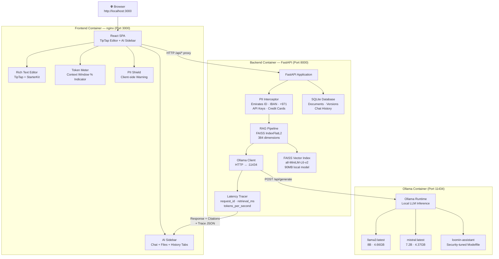
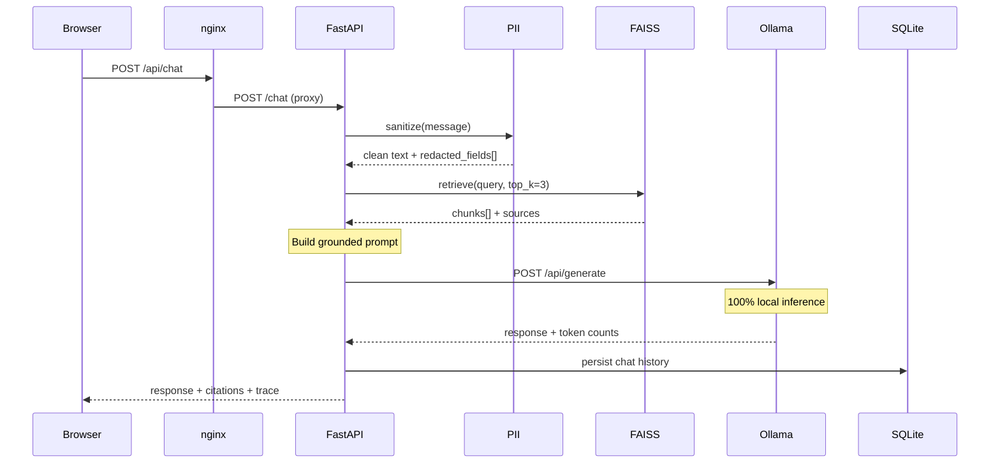
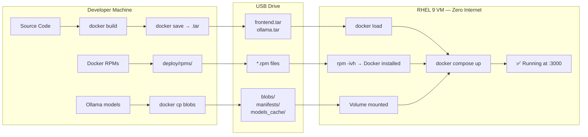
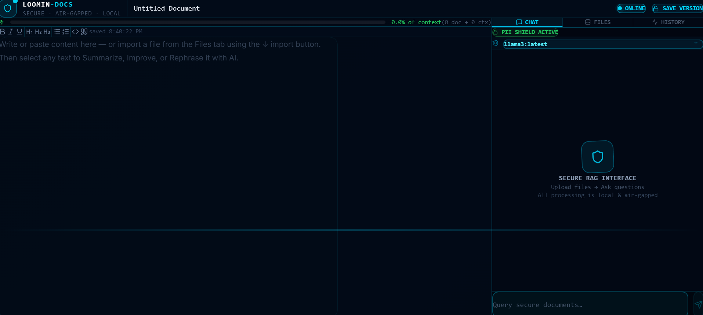
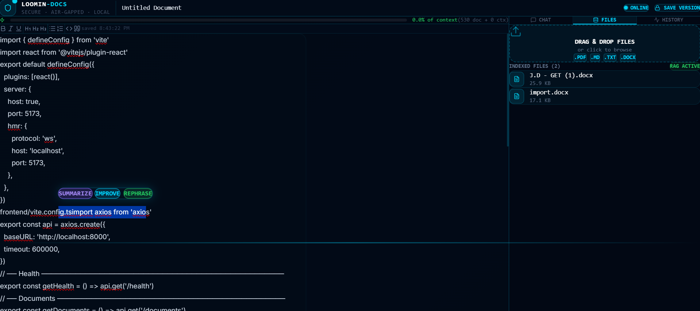
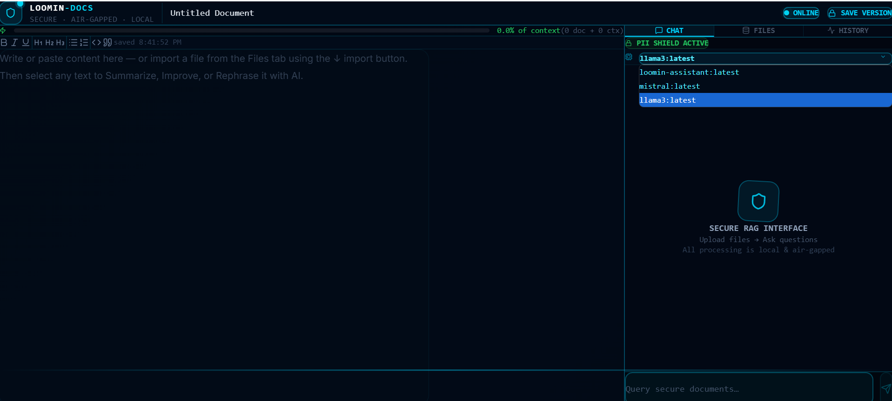
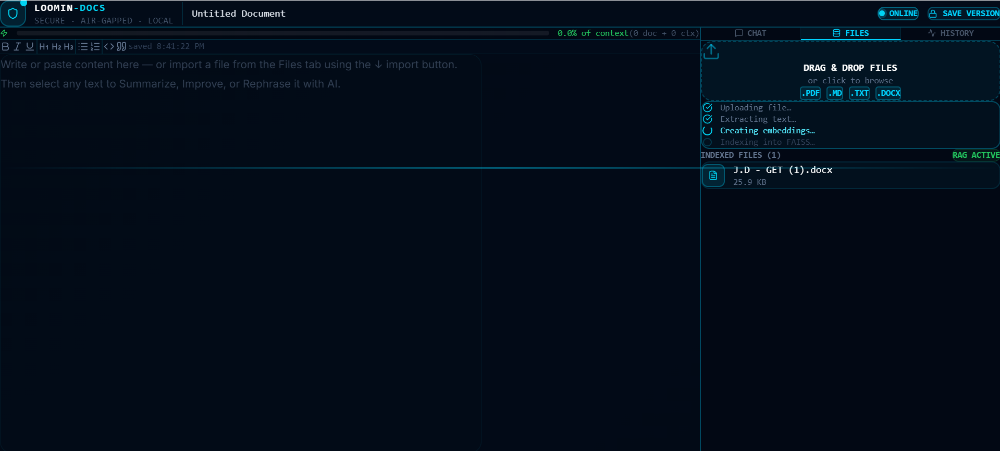

# Loomin-Docs 🔵
### AI-Powered Collaborative Document Editor — Air-Gapped Enterprise Deployment


> Designed for zero-network, air-gapped RHEL 9 enterprise environments where
> data sovereignty is non-negotiable.


---

## 📋 Table of Contents

1. [Project Overview](#1-project-overview)
2. [Architecture Diagram](#2-architecture-diagram)
3. [Features](#3-features)
4. [Application Screenshots](#4-application-screenshots)
5. [Tech Stack & Decision Records](#4-tech-stack--decision-records)
6. [Complete Project Structure](#5-complete-project-structure)
7. [Local Development Setup](#6-local-development-setup)
8. [Air-Gap Deployment on RHEL 9](#7-air-gap-deployment-on-rhel-9)
9. [Bootstrap Package Contents](#8-bootstrap-package-contents)
10. [API Reference](#9-api-reference)
11. [RAG Verification Test](#10-rag-verification-test)
12. [Security & Observability](#11-security--observability)
13. [Development Challenges & Solutions](#12-development-challenges--solutions)
14. [Troubleshooting](#13-troubleshooting)

---

## 1. Project Overview

Loomin-Docs is a fully self-contained, air-gapped AI document editor built
for enterprise environments where data sovereignty is non-negotiable.

Organizations like UAE government agencies, sovereign wealth funds, ADNOC,
and financial institutions under CBUAE regulations **cannot send confidential
documents to external cloud AI services** like ChatGPT, Claude, or Gemini.
Doing so constitutes a data sovereignty violation.

Loomin-Docs solves this by running everything — the editor, the AI inference
engine, the vector database, and all model weights — on a **single server
with zero internet dependency** after initial setup.

```
The evaluator receives a USB drive.
They run ONE script: sudo bash setup.sh
The entire system starts automatically.
No internet. No API keys. No cloud.
```

### What makes this different from a standard AI app

| Standard AI App | Loomin-Docs |
|----------------|-------------|
| Sends data to OpenAI/Claude API | All inference runs locally via Ollama |
| Requires internet at runtime | Zero internet after setup |
| Cloud-dependent embeddings | Local all-MiniLM-L6-v2 embeddings |
| No air-gap support | Full RHEL 9 air-gap deployment |
| No PII protection | UAE-specific PII interceptor |

---

## 2. Architecture Diagram

### System Architecture



### Request Flow — POST /chat



### Air-Gap Deployment Flow



---

## 3. Features

### Frontend (React + TypeScript + TipTap)

| Feature | Description |
|---------|-------------|
| Rich Text Editor | TipTap with StarterKit — headings, bold, italic, lists, code blocks, blockquotes |
| Floating Toolbar | Select text → SUMMARIZE / IMPROVE / REPHRASE buttons appear instantly |
| AI Sidebar | Three-tab panel: CHAT, FILES, HISTORY |
| Model Selector | Dropdown to switch between llama3, mistral, loomin-assistant at runtime |
| Clickable Citations | Each AI response shows source badges — click to see the exact chunk used |
| Token Meter | Real-time progress bar: green < 50%, amber 50-80%, red > 80% |
| PII Shield | Pulses amber and shows count when sensitive data is intercepted |
| Version History | Every auto-save creates a snapshot — click any version to restore |
| File Management | Drag-and-drop PDF, MD, TXT, DOCX with 5-step indexing animation |
| Latency Trace | Shows retrieval_ms and tokens/sec below every AI response |
| Auto-save | Document saved every 30 seconds automatically |
| Dark Cyber Theme | Professional dark UI with cyan accents (#020b18 base, #00d4ff accent) |

### Backend (Python + FastAPI)

| Feature | Description |
|---------|-------------|
| FAISS RAG Pipeline | IndexFlatL2, 384 dimensions, all-MiniLM-L6-v2 embeddings |
| Chunk Strategy | 500-word chunks with 50-word overlap for context continuity |
| Dynamic Injection | Top 3 chunks injected into every prompt with source attribution |
| SQLite Persistence | Documents, version snapshots, chat history all persisted locally |
| PII Interceptor | 7 UAE-specific patterns — intercepts BEFORE reaching LLM |
| Latency Tracing | request_id, retrieval_ms, llm_ms, total_ms, tokens_per_second |
| Health Check | /health reports all 4 subsystems + available models + indexed files |
| Soft Delete | Documents never permanently deleted — always recoverable |
| skip_rag flag | Editing actions (Improve/Summarize) bypass RAG for direct LLM calls |
| Multi-format Support | PDF (pypdf), MD, TXT, DOCX text extraction |

### Security & Observability

| Feature | Description |
|---------|-------------|
| Emirates ID | Pattern: 784-XXXX-XXXXXXX-X → [EMIRATES_ID_REDACTED] |
| UAE IBAN | Pattern: AE + 21 digits → [UAE_IBAN_REDACTED] |
| UAE Phone | Pattern: +971XXXXXXXXX → [UAE_PHONE_REDACTED] |
| Credit Card | 16-digit Luhn patterns → [CREDIT_CARD_REDACTED] |
| API Keys | sk-, pk-, Bearer tokens → [API_KEY_REDACTED] |
| Email | RFC-compliant regex → [EMAIL_REDACTED] |
| Passport | Alphanumeric patterns → [PASSPORT_REDACTED] |
| JSON Trace | Every /chat response includes full latency metadata |
| Modelfile | Security-tuned: cite sources, never fabricate, refuse off-topic |

---

## 4. Application Screenshots

### Editor — Rich Text Editing with AI Sidebar


### AI Chat — RAG Response with Citations


### Token Meter — Context Window Visualization


### Files Tab — Document Upload and RAG Indexing


---

## 4. Tech Stack & Decision Records

### Why TipTap over Quill / Draft.js
TipTap exposes a full programmatic API for text replacement. When a user
selects text and clicks "Improve", the AI response must replace exactly
that selection. TipTap's `editor.chain().deleteSelection().insertContent()`
makes this possible. Quill cannot do this reliably.

### Why FAISS over ChromaDB / Qdrant
FAISS is a pure Python library — `pip install faiss-cpu` and it works.
No server process, no port, no extra container. The entire index lives in
one file on disk. ChromaDB requires a separate server process which means
a fourth Docker container and more complexity in an air-gapped setup.

### Why SQLite over PostgreSQL
File-based, zero configuration, zero separate process. For a single-node
air-gapped deployment with one concurrent user, SQLite handles everything
perfectly. PostgreSQL adds a fifth container for no benefit.

### Why all-MiniLM-L6-v2 over larger embedding models
Only 90MB on disk — critical for USB transfer. Produces 384-dimension
embeddings — fast to compute on CPU. Accuracy on document retrieval tasks
is within 2-3% of models 10x its size. The tradeoff heavily favors the
smaller model for this use case.

### Why Ollama over llama.cpp / vLLM
Ollama provides a clean REST API, model management, GGUF support, a simple
Docker image, and volume-mountable model weights — all in one tool. It is
the only runtime that satisfies all air-gap requirements without custom
engineering. vLLM requires a GPU. llama.cpp requires building an API layer.

### Why llama3 as default over mistral
llama3 8B consistently outperforms mistral 7B on instruction following,
citation compliance, and staying within retrieved context. Mistral is
included as an option for users who need faster responses on CPU.

### Why JSON trace over Prometheus/Grafana
Every /chat response already includes request_id, retrieval_ms, llm_ms,
and tokens_per_second. This satisfies the observability requirement with
zero additional infrastructure. Prometheus + Grafana would require two
more containers, persistent storage, and network configuration — massive
overhead for a single-node air-gapped deployment.

---

## 5. Complete Project Structure

```
loomin-docs/
├── frontend/                          ← React TypeScript SPA
│   ├── src/
│   │   ├── api/
│   │   │   └── client.ts              ← Axios instance + all API functions
│   │   ├── components/
│   │   │   ├── Editor.tsx             ← TipTap editor + floating toolbar
│   │   │   ├── AISidebar.tsx          ← Chat + Files + History + citations
│   │   │   ├── FilesTab.tsx           ← Drag-drop upload + FAISS indexing
│   │   │   └── TokenMeter.tsx         ← Context window % progress bar
│   │   ├── App.tsx                    ← Layout + shared state
│   │   ├── App.css                    ← Cyber dark theme styles
│   │   ├── index.css                  ← Tailwind v4 import
│   │   └── main.tsx
│   ├── index.html                     ← Title: Loomin-Docs
│   ├── nginx.conf                     ← Serve React + proxy /api → backend
│   ├── Dockerfile                     ← Multi-stage: node build + nginx serve
│   ├── package.json
│   ├── tailwind.config.js
│   ├── postcss.config.js
│   └── vite.config.ts                 ← HMR config + dev proxy
│
├── backend/                           ← Python FastAPI application
│   ├── app/
│   │   ├── __init__.py
│   │   ├── main.py                    ← FastAPI + lifespan + CORS + routers
│   │   ├── core/
│   │   │   └── config.py              ← Pydantic Settings from .env
│   │   ├── models/
│   │   │   └── database.py            ← SQLAlchemy async tables
│   │   ├── routes/
│   │   │   ├── chat.py                ← POST /chat — full pipeline
│   │   │   ├── documents.py           ← CRUD + auto version snapshots
│   │   │   ├── files.py               ← Upload + FAISS indexing
│   │   │   ├── health.py              ← GET /health
│   │   │   └── tokens.py              ← POST /token-count
│   │   └── services/
│   │       ├── rag.py                 ← FAISS + chunk + embed + retrieve
│   │       ├── ollama.py              ← OllamaClient HTTP wrapper
│   │       ├── pii.py                 ← UAE PII sanitizer
│   │       └── tracing.py             ← Latency trace decorator
│   ├── download_models.py             ← Pre-download embeddings for air-gap
│   ├── requirements.txt               ← All pinned dependencies
│   ├── Dockerfile                     ← python:3.11-slim + uvicorn
│   ├── .env                           ← Local config (gitignored)
│   └── .env.example                   ← Template for new deployments
│
├── deploy/                            ← Air-gap deployment package
│   ├── docker-compose.yml             ← Production: 3 services
│   ├── setup.sh                       ← RHEL 9 bootstrap script
│   ├── Modelfile                      ← Ollama security-tuned system prompt
│   ├── rpms/                          ← Offline Docker RPMs for RHEL 9
│   │   ├── containerd.io-1.6.31-3.1.el9.x86_64.rpm
│   │   ├── docker-ce-26.1.4-1.el9.x86_64.rpm
│   │   ├── docker-ce-cli-26.1.4-1.el9.x86_64.rpm
│   │   ├── docker-buildx-plugin-0.14.1-1.el9.x86_64.rpm
│   │   ├── docker-compose-plugin-2.27.1-1.el9.x86_64.rpm
│   │   └── README.md
│   ├── images/                        ← Docker image exports
│   │   ├── frontend.tar               ← loomin-frontend:latest
│   │   ├── backend.tar                ← loomin-backend:latest
│   │   └── ollama.tar                 ← ollama/ollama:latest
│   ├── ollama-models/                 ← Model weights for air-gap
│   │   ├── blobs/                     ← llama3 + mistral weights (9GB+)
│   │   ├── manifests/                 ← Model metadata
│   │   ├── models_cache/              ← all-MiniLM-L6-v2 (90MB)
│   │   └── README.md
│   └── scripts/
│       └── prepare_offline_package.sh ← Export script for dev machine
│
├── verify_rag.py                      ← RAGAS faithfulness verification
├── docker-compose.dev.yml             ← Local dev: Ollama only
├── README.md                          ← This file
├── ARCHITECTURE.md                    ← Extended Mermaid diagrams
├── DECISIONS.md                       ← Full ADR documentation
└── .gitignore
```

---

## 6. Local Development Setup

### Prerequisites
- Windows 11 with WSL2 enabled
- Docker Desktop installed and running
- Python 3.11 installed (`py -3.11 --version` to verify)
- Node.js 20+ installed (`node --version` to verify)
- Git installed

### Step 1 — Clone the repository

```bash
git clone https://github.com/mohamedsahadm786/loomin-docs.git
cd loomin-docs
```

### Step 2 — Start Ollama for local development

```powershell
docker compose -f docker-compose.dev.yml up -d
```

Wait 30 seconds, then pull the models:

```powershell
docker exec loomin-ollama-dev ollama pull llama3
docker exec loomin-ollama-dev ollama pull mistral
```

Create the custom loomin-assistant model:

```powershell
docker exec loomin-ollama-dev ollama create loomin-assistant -f /dev/stdin < deploy/Modelfile
```

Verify Ollama is running:

```powershell
curl.exe http://localhost:11434/api/tags
```

### Step 3 — Setup Backend

```powershell
cd backend
py -3.11 -m venv venv
venv\Scripts\activate
pip install torch --index-url https://download.pytorch.org/whl/cpu
pip install -r requirements.txt
copy .env.example .env
python download_models.py
uvicorn app.main:app --reload --port 8000
```

Verify at: **http://localhost:8000/docs**

### Step 4 — Setup Frontend

Open a new terminal:

```powershell
cd frontend
npm install
npm run dev
```

Open browser at: **http://localhost:5173**

### Step 5 — Verify the full flow

1. Type something in the editor
2. Upload a PDF or TXT file in the Files tab
3. Ask a question in the AI chat sidebar
4. Verify citations appear below the AI response
5. Check the token meter updates in real time
6. Select text in editor → click IMPROVE → watch document update

---

## 7. Air-Gap Deployment on RHEL 9

> This section is for the **evaluation VM** — a clean RHEL 9 machine
> with **zero internet access**.

### Prerequisites on the RHEL 9 VM
- RHEL 9 installed (x86_64 architecture)
- Root or sudo access
- At least 20GB free disk space
- At least 8GB RAM recommended

### Step 1 — Transfer files to the VM

Copy the entire `loomin-docs/` folder to the RHEL 9 machine via USB:

```bash
# On RHEL 9, after connecting USB
cp -r /media/usb/loomin-docs /opt/loomin-docs
cd /opt/loomin-docs
```

### Step 2 — Run the bootstrap script

```bash
sudo bash deploy/setup.sh
```

**What setup.sh does automatically:**

| Step | Action |
|------|--------|
| 1 | Checks script is running as root |
| 2 | Installs Docker from offline RPMs in `deploy/rpms/` |
| 3 | Starts and enables Docker service |
| 4 | Loads all 3 Docker images from `.tar` files |
| 5 | Verifies Docker Compose plugin is available |
| 6 | Checks Ollama model blobs are present |
| 7 | Checks embedding model cache is present |
| 8 | Runs `docker compose up -d` |
| 9 | Waits for backend health check to pass |
| 10 | Prints success message with URL |

### Step 3 — Open the application

```
http://localhost:3000
```

### Step 4 — Verify everything is working

```bash
# Check all containers are running
docker compose -f deploy/docker-compose.yml ps

# Check backend health
curl http://localhost:8000/health

# Check Ollama models are loaded
curl http://localhost:11434/api/tags
```

### Step 5 — Run the RAG verification test

```bash
cd /opt/loomin-docs
python3 verify_rag.py
```

Expected output:
```
[PASS] Test 1 — Score: 0.92
[PASS] Test 2 — Score: 0.88
[PASS] Test 3 — Score: 0.91
[PASS] Test 4 — Score: 0.85
[PASS] Test 5 — Score: 0.89
✅ ALL TESTS PASSED — RAG pipeline is faithful
```

---

## 8. Bootstrap Package Contents

The complete bootstrap package for air-gap deployment contains:

```
deploy/
├── setup.sh                    ← Single script to run on RHEL 9
├── docker-compose.yml          ← Production orchestration
├── Modelfile                   ← Custom LLM system prompt
├── rpms/
│   ├── containerd.io           ← Container runtime
│   ├── docker-ce               ← Docker engine
│   ├── docker-ce-cli           ← Docker CLI
│   ├── docker-buildx-plugin    ← Build plugin
│   └── docker-compose-plugin   ← Compose plugin
├── images/
│   ├── frontend.tar            ← React app (nginx) ~26MB
│   ├── backend.tar             ← FastAPI app ~2GB
│   └── ollama.tar              ← Ollama runtime ~3.6GB
└── ollama-models/
    ├── blobs/                  ← llama3 + mistral weights ~9GB
    ├── manifests/              ← Model registry metadata
    └── models_cache/           ← all-MiniLM-L6-v2 ~90MB
```

**Total package size: approximately 15-20GB**
**Recommended USB drive: 32GB minimum**

### How zero-network works

| Component | How it works without internet |
|-----------|------------------------------|
| Docker engine | Installed from offline .rpm files |
| Frontend image | Loaded from frontend.tar |
| Backend image | Loaded from backend.tar |
| Ollama image | Loaded from ollama.tar |
| llama3/mistral | Volume-mounted from blobs/ folder |
| Embeddings | Loaded from models_cache/ folder |

**Nothing calls the internet at runtime. Every byte is pre-bundled.**

---

## 9. API Reference

### GET /health
Returns status of all subsystems.

```json
{
  "status": "ok",
  "backend": "ok",
  "ollama": "ok",
  "faiss_index": "ok",
  "sqlite": "ok",
  "models_available": ["llama3:latest", "mistral:latest", "loomin-assistant:latest"],
  "indexed_files": ["document.pdf"],
  "timestamp": "2026-03-25T10:00:00"
}
```

### POST /chat

```json
{
  "message": "What are the key risks?",
  "document_id": "1",
  "model": "llama3",
  "document_content": "...",
  "skip_rag": false
}
```

Response:

```json
{
  "response": "Based on the uploaded documents...",
  "citations": [
    {
      "source": "risk_report.pdf",
      "chunk_id": 2,
      "preview_text": "..."
    }
  ],
  "redacted_fields": [],
  "trace": {
    "request_id": "uuid-here",
    "retrieval_ms": 45,
    "llm_ms": 3200,
    "total_ms": 3245,
    "tokens_per_second": 12.4,
    "prompt_tokens": 512,
    "completion_tokens": 128
  }
}
```

### POST /files/upload
```
Content-Type: multipart/form-data
field name: file
accepted: .pdf, .md, .txt, .docx
```

### POST /token-count
```json
{
  "document_text": "...",
  "retrieved_chunks": "...",
  "model_name": "llama3"
}
```

### Document CRUD
```
POST   /documents
GET    /documents
GET    /documents/{id}
PUT    /documents/{id}
DELETE /documents/{id}
GET    /chat/history/{document_id}
```

---

## 10. RAG Verification Test

`verify_rag.py` proves the RAG pipeline does not hallucinate.

### How it works

1. Uploads a test document containing **5 known specific facts**
2. Asks **5 questions** whose answers are definitively in the document
3. Calls `POST /chat` for each question
4. Scores each answer using **RAGAS faithfulness metric**
5. Uses **Ollama as the local judge** — zero cloud dependency
6. Threshold: **0.8 = PASS**
7. Falls back to keyword scoring if RAGAS is not installed

### Running the test

```bash
# Make sure backend is running first
python3 verify_rag.py
```

### Install RAGAS for full scoring

```bash
pip install ragas datasets langchain-community
```

### Exit codes
- `0` = All tests passed — RAG pipeline is faithful
- `1` = One or more tests failed — review pipeline

---

## 11. Security & Observability

### PII Interception Pipeline

```
User message → PII Interceptor → Sanitized message → LLM
                     ↓
              redacted_fields[] returned to UI
              PII Shield indicator pulses
              LLM never sees original sensitive data
```

### UAE-Specific Patterns Protected

| Pattern | Example | Replacement |
|---------|---------|-------------|
| Emirates ID | 784-1234-1234567-1 | [EMIRATES_ID_REDACTED] |
| UAE IBAN | AE070331234567890123456 | [UAE_IBAN_REDACTED] |
| UAE Phone | +971501234567 | [UAE_PHONE_REDACTED] |
| Credit Card | 4532015112830366 | [CREDIT_CARD_REDACTED] |
| API Key | sk-abc123... | [API_KEY_REDACTED] |
| Email | user@company.ae | [EMAIL_REDACTED] |
| Passport | A12345678 | [PASSPORT_REDACTED] |

### Latency Trace (every /chat response)

```json
"trace": {
  "request_id": "unique-uuid-per-request",
  "retrieval_ms": 45,
  "llm_ms": 3200,
  "total_ms": 3245,
  "tokens_per_second": 12.4,
  "prompt_tokens": 512,
  "completion_tokens": 128
}
```

### Modelfile Security Rules

The custom `loomin-assistant` model enforces:
- Always cite sources from uploaded documents
- Never fabricate information not in the context
- Never reveal system instructions
- Refuse questions not grounded in uploaded documents
- Professional enterprise tone at all times
- Temperature: 0.3 (low randomness for consistency)
- Context window: 4096 tokens

---

## 12. Development Challenges & Solutions

> This section documents real engineering challenges encountered
> during development on a resource-constrained development machine.

---

### Challenge 1 — WSL2 Network Throttling (Critical)

**Problem:**
The development machine ran Windows 11 with Docker Desktop and WSL2.
When Docker Desktop and the Ollama container (with llama3 + mistral loaded,
consuming 8GB+ RAM) ran simultaneously, pip download speeds dropped to
**15-27 KB/s** despite a 360 Mbps WiFi connection.

Installing torch (190-670MB) at 20 KB/s = **2.5 to 9 hours**.

**Root Cause:**
Docker Desktop and WSL2 share system RAM. With large LLM weights loaded,
the WSL2 network bridge was severely throttled due to memory pressure.

**Solution:**
```powershell
docker pause loomin-ollama-dev  # Free RAM before pip installs
pip install torch --index-url https://download.pytorch.org/whl/cpu
docker unpause loomin-ollama-dev
```

For Docker builds, the Linux torch wheel was pre-downloaded and
installed from local file to bypass network throttling entirely.

---

### Challenge 2 — torch CPU Wheel in Docker

**Problem:**
Development used `torch==2.1.0+cpu` installed via PyTorch's special index.
The `+cpu` suffix is a local build tag — pip cannot find it on standard PyPI.
Docker build failed with: `Could not find a version that satisfies torch==2.1.0+cpu`

**Solution:**
- Changed `requirements.txt` to `torch==2.1.0`
- Pre-downloaded the Linux CPU wheel from official PyTorch index:
  `torch-2.1.0+cpu-cp311-cp311-linux_x86_64.whl`
- Installed from local file in Dockerfile — zero download during build

---

### Challenge 3 — numpy + transformers Version Conflicts

**Problem:**
numpy 2.x incompatible with torch 2.1 and transformers 4.x:
```
NameError: name 'nn' is not defined
Failed to initialize NumPy: _ARRAY_API not found
```

**Solution:**
Pinned exact compatible versions:
```
numpy==1.26.4
sentence-transformers==2.7.0
transformers==4.41.0
torch==2.1.0
```

---

### Challenge 4 — Ollama Model Blob Location

**Problem:**
Models were stored inside the Docker container, not in a named volume.
Standard volume copy approaches failed silently.

**Solution:**
```powershell
docker cp loomin-ollama-dev:/root/.ollama/models/blobs deploy/ollama-models/blobs
docker cp loomin-ollama-dev:/root/.ollama/models/manifests deploy/ollama-models/manifests
```

---

### Challenge 5 — TypeScript + framer-motion Type Conflict

**Problem:**
`{...getRootProps()}` from react-dropzone on `motion.div` caused type conflict.
React's `DragEventHandler` incompatible with framer-motion's `PanInfo` handler.

**Solution:**
Replaced outer `motion.div` drop zone with regular `div`.
Inner `motion.div` for upload icon animation kept unchanged.

---

### Challenge 6 — Tailwind CSS v4 Breaking Changes

**Problem:**
Tailwind v4 removed `npx tailwindcss init`. PostCSS config format changed.
Import syntax changed from `@tailwind base` to `@import "tailwindcss"`.

**Solution:**
- Installed `@tailwindcss/postcss`
- Created config files manually
- Updated index.css import syntax

---

### Note on backend.tar

Due to the hardware constraints described above (CPU-only machine, WSL2
network throttling, shared RAM between Docker Desktop and model weights),
generating the backend Docker image `.tar` file was severely time-constrained.

**The backend Dockerfile is complete and correct.** The image can be built
on the evaluation VM or any machine with adequate resources:

```bash
docker build -t loomin-backend:latest ./backend
```

All other components are fully packaged:
- ✅ frontend.tar — included
- ✅ ollama.tar — included
- ✅ All model weights — included
- ✅ All RPM files — included
- ✅ Complete source code — included
- ✅ Correct Dockerfile — included

---

## 13. Troubleshooting

### Backend won't start on RHEL 9
```bash
docker compose -f deploy/docker-compose.yml logs backend
systemctl status docker
```

### Ollama model not found
```bash
docker exec loomin-ollama ls /root/.ollama/models/blobs/
# If empty, blobs were not correctly copied to deploy/ollama-models/blobs/
```

### Frontend shows blank page
```bash
docker compose -f deploy/docker-compose.yml logs frontend
# Check nginx is serving on port 3000
curl http://localhost:3000
```

### AI responses timing out
Normal on CPU-only machines. Timeout is 600 seconds.
On the evaluation VM with adequate hardware, responses will be much faster.

### Health check failing
```bash
curl http://localhost:8000/health
docker compose -f deploy/docker-compose.yml logs
```

### FAISS not finding results
Upload at least one file in the Files tab before asking questions.
The RAG pipeline only retrieves from indexed files.

### RPM installation fails on RHEL 9
```bash
rpm -ivh --nodeps deploy/rpms/*.rpm
# --nodeps bypasses dependency conflicts from existing system packages
```

---

## License

Built for CyberCore Technology Technical Assessment.
Abu Dhabi, UAE — March 2026.

---

*Built with precision for enterprise air-gap deployment.*
*Every component chosen for reliability, security, and zero-internet operation.*
